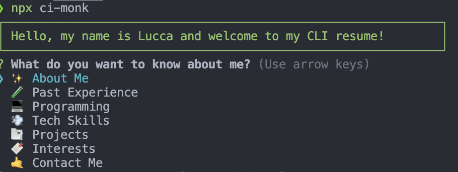

<div align="center">


<h2>Personal Resume</h2>

<div align="center">

[]()
[]()
[]()
[](https://www.npmjs.org/package/lpsm-dev)

</div>

---


<h4>This is a simple npm package with my technical resume in a CLI way</h4>

</div>

---

## ➤ Description

Do you love coding and want to show off your skills? Try out this CLI resume! You can customize it to your liking and use it to present your abilities. By using `npx`, it's easy to display your resume in the terminal, making it accessible to tech people.

## ➤ Options

<p align="center">
  
</p>

As of now there are below options:

- ✨ About Me
- 🧪 Past Experience
- 💻 Programming
- 💨 Tech Skills
- 📑 Projects
- 🔖 Interests
- 🤙 Contact Me
- 💸 Donations

## ➤ Usage

Ways to run and use this project.

**Node**

<details>
<summary>Local</summary>
<p>

```bash
npm start
```

or

```bash
node index.js
```

</p>
</details>

<details>
<summary>Published</summary>
<p>

```bash
npx lpsm-dev
```

</p>
</details>

**Docker**

<details>
<summary>Container</summary>
<p>

Just a simple example that you can use to run this container:

```bash
docker run -it --rm --name personal-resume ghcr.io/lpsm-dev/personal-resume:main
```

Click [here](https://github.com/lpsm-dev/personal-resume/pkgs/container/personal-resume/versions) to see available image tags.
</p>
</details>

## ➤ Demo

https://user-images.githubusercontent.com/58797390/148670421-fce972b2-8c13-4358-95ae-cd5ee6ac4d69.mov

## ➤ Learning

- Setup a NPM publish pipeline using github actions.
- Setup a Docker build + scan pipeline using github actions.
- Create a node setup project to create a CLI.
- Create a release flow in github actions.
- Create a multistage node Dockerfile.
- Organize a git repo using pre-commit, editorconfig, gitignore and others.
- Setup make commands using Makefile.

## ➤ Inspirations <a name = "inspirations"></a>

* Thanks [@Neha](https://github.com/Neha/resume-cli) for sharing your project.

## ➤ Author

👤 Hey!! If you like this project or if you find some bugs feel free to contact me in my channels:

>
> * Linktree: https://linktr.ee/lpmatos
>

## ➤ Versioning

To check the change history, please access the [**CHANGELOG.md**](CHANGELOG.md) file.

## ➤ Show your support

<div align="center">

Give me a ⭐️ if this project helped you!


Made with 💜 by [me](https://github.com/lpsm-dev) 👋 inspired on [readme-md-generator](https://github.com/kefranabg/readme-md-generator)

</div>
