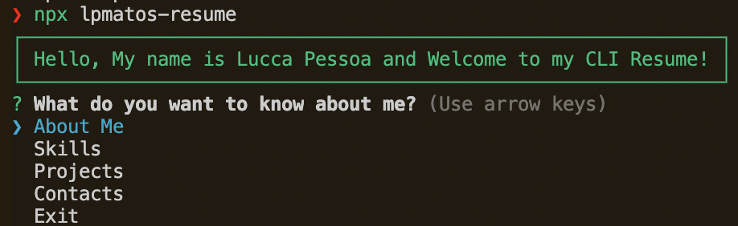

<div align="center">

<p>
  
</p>

<h2 align="center">✨ My personal CLI resume ✨</h2>

<div align="center">

[](https://github.com/lpmatos/personal-resume)
[](https://github.com/lpmatos/personal-resume)
[](https://github.com/lpmatos/personal-resume)
[](https://www.npmjs.org/package/lpmatos-resume)
[](https://github.com/lpmatos/personal-resume/blob/main/LICENSE)
[](https://github.com/lpmatos/personal-resume/actions/workflows/ci.yml)
[](https://github.com/lpmatos/personal-resume)

</div>

---

<p align="center">
  
</p>

<p align="center">
  ✨ This is a simples npm package of my personal resume in a CLI way ✨
</p>

<p align="center">
  <a href="#getting-started">Getting Started</a>&nbsp;&nbsp;&nbsp;|&nbsp;&nbsp;&nbsp;
  <a href="#contributing">Contributing</a>&nbsp;&nbsp;&nbsp;|&nbsp;&nbsp;&nbsp;
  <a href="#versioning">Versioning</a>
</p>

</div>

---

## ➤ Getting Started <a name = "getting-started"></a>

If you want contribute on this project, first you need to make a **git clone**:

>
> 1. git clone --depth 1 <https://github.com/personal-resume.git> -b main
>

This will give you access to the code on your **local machine**.

## ➤ Patterns and Tools <a name = "techs"></a>

In this project i'm using:

- JavaScript and NPM,
- Docker containers,
- GitHub Actions,
- Pre-commit, hadolint, trivy, snyk and gitleaks,
- Conventional commits and Semantic release.

## ➤ Description <a name = "description"></a>

Are you an aspiring developer? Want to show off your coding skills. Then here is a CLI of your resume (or you can use it in any innovative way, as you want). This CLI is focused on my resume and skills. It has basics information and can be expanded. The idea it's display this information through the terminal using npx.

### Options

- ✨ About Me
- 🧪 Past Experience
- 💨 Tech Skills
- 📑 Projects
- 🔖 Interests
- 🤙 Contact Me

## ➤ Usage <a name = "usage"></a>

### Node

<details><summary>Local</summary>
<p>

Local execution method:

```bash
npm start
```

or

```bash
node index.js
```
</p>
</details>

<details><summary>Published</summary>
<p>

Published npm Package execution method:

```bash
npx lpmatos-resume
```
</p>
</details>

### Docker

```bash
docker container run -it --rm ghcr.io/lpmatos/personal-resume:main
```

## ➤ Visuals <a name = "visuals"></a>

Depending on what you are making, it can be a good idea to include screenshots or even a video (you'll frequently see GIFs rather than actual videos). Tools like ttygif can help, but check out Asciinema for a more sophisticated method.

<p align="center">
  
</p>

## ➤ Author <a name = "author"></a>

👤 **Lucca Pessoa**

Hey!! If you like this project or if you find some bugs feel free to contact me in my channels:

>
> * Email: luccapsm@protonmail.com
> * Website: https://github.com/lpmatos
> * GitHub: [@lpmatos](https://github.com/lpmatos)
> * GitLab: [@lpmatos](https://gitlab.com/lpmatos)
>

## ➤ Versioning <a name = "versioning"></a>

To check the change history, please access the [**CHANGELOG.md**](CHANGELOG.md) file.

## ➤ Troubleshooting <a name = "troubleshooting"></a>

If you have any problems, please contact [me](https://github.com/lpmatos).

## ➤ Project status <a name = "project-status"></a>

If you have run out of energy or time for your project, put a note at the top of the README saying that development has slowed down or stopped completely. Someone may choose to fork your project or volunteer to step in as a maintainer or owner, allowing your project to keep going. You can also make an explicit request for maintainers. Currently the project is constantly being updated 👾.

## ➤ Show your support <a name = "show-your-support"></a>

Give a ⭐️ if this project helped you!

---

<div align="center">

Made with 💜 by [me](https://github.com/lpmatos) :wave: inspired on [readme-md-generator](https://github.com/kefranabg/readme-md-generator)

</div>
